# 🎯 MAUGUS GitHub Standards

This repository contains organization-wide GitHub templates, workflows, and standards for all MAUGUS projects.

## 📋 What's Included

### 🏷️ Labels System
- **Prefixed labels** for better organization:
  - `type/*` - Issue/PR types (bug, feature, docs, etc.)
  - `priority/*` - Priority levels (critical, high, medium, low)
  - `status/*` - Work status (ready, in-progress, blocked, review)
  - `scope/*` - Project areas (backend, frontend, infra, etc.)
  - `meta/*` - Special labels (help-wanted, good-first-issue, etc.)

### 📝 Issue & PR Templates
- **Bug Report** - Structured bug reporting with environment details
- **Feature Request** - Feature proposals with acceptance criteria
- **Task** - General tasks and chores
- **Pull Request** - Comprehensive PR template with checklists

### 🤖 GitHub Actions Workflows
- **CI Pipeline** - Multi-language support (Node.js, Python, Go)
- **Label Sync** - Automatic label synchronization
- **PR Size Check** - Enforce small, reviewable PRs (≤800 LOC)
- **Security Scanning** - CodeQL and dependency checks
- **Release Automation** - Semantic versioning and changelogs

### 📚 Documentation
- **CONTRIBUTING.md** - Detailed contribution guidelines
- **CODEOWNERS** - Automatic review assignment
- **Branch Protection** - Secure development workflow

## 🚀 Quick Start

### For New Repositories

```bash
# 1. Create your repository
gh repo create my-awesome-project

# 2. Clone it
git clone https://github.com/MAUGUS2/my-awesome-project
cd my-awesome-project

# 3. Apply MAUGUS standards
curl -sSL https://raw.githubusercontent.com/MAUGUS2/.github/main/scripts/apply-standards.sh | bash
```

### For Existing Repositories

```bash
# 1. Go to your repository
cd existing-project

# 2. Download and run the standards script
curl -o apply-standards.sh https://raw.githubusercontent.com/MAUGUS2/.github/main/scripts/apply-standards.sh
chmod +x apply-standards.sh
./apply-standards.sh

# 3. Commit the changes
git add .
git commit -m "chore: apply MAUGUS GitHub standards"
git push
```

## 📐 Standards Overview

### Branch Naming
```
<type>/<issue-number>-<brief-description>

Examples:
- feat/123-add-user-auth
- fix/124-resolve-memory-leak
- docs/125-update-api-guide
```

### Commit Messages
```
<type>(<scope>): <subject>

Examples:
- feat(auth): add OAuth2 support
- fix(ui): correct button alignment
- docs(api): update endpoint examples
```

### PR Guidelines
- Keep PRs small (≤ 800 lines of code)
- One feature/fix per PR
- Link to related issue
- Pass all CI checks
- Get at least one approval

## 🔧 Customization

### Adding Project-Specific Labels

1. Edit `labels/labels.json`
2. Add your custom labels
3. Run label sync workflow

### Modifying Templates

1. Fork this repository
2. Customize templates in `.github/`
3. Update your repos to point to your fork

### Workflow Adjustments

Each workflow can be customized:
- Edit workflow files in `.github/workflows/`
- Adjust triggers, permissions, and steps
- Test in a feature branch first

## 📊 Workflow Diagram

```mermaid
graph LR
    A[Create Issue] --> B[status/ready]
    B --> C[Developer picks issue]
    C --> D[status/in-progress]
    D --> E[Create feature branch]
    E --> F[Open Draft PR]
    F --> G[Development]
    G --> H[Mark PR ready]
    H --> I[status/review]
    I --> J[Code Review]
    J --> K[Merge to main]
    K --> L[Issue closed]
    L --> M[Deploy]
```



## 🛡️ Security

- Branch protection on `main` and `develop`
- Required PR reviews
- CI must pass before merge
- No direct commits to protected branches
- Signed commits recommended

## 📈 Metrics & Monitoring

Track your project health:
- PR size distribution
- Time to merge
- Issue resolution time
- Test coverage trends
- Dependency updates

## 🤝 Contributing

We welcome contributions! Please:

1. Read our [Contributing Guide](CONTRIBUTING.md)
2. Check existing issues
3. Follow our standards
4. Submit small, focused PRs

## 📞 Support

- 💬 [Discussions](https://github.com/MAUGUS2/discussions) - Questions & ideas
- 🐛 [Issues](https://github.com/MAUGUS2/.github/issues) - Bug reports
- 📧 [Email](mailto:contact@maugus.dev) - Private concerns

## 📜 License

MIT License - See [LICENSE](LICENSE) file

---

<p align="center">
  Made with ❤️ by MAUGUS
</p>